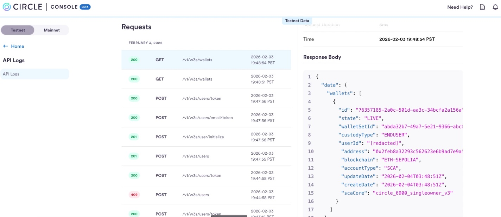
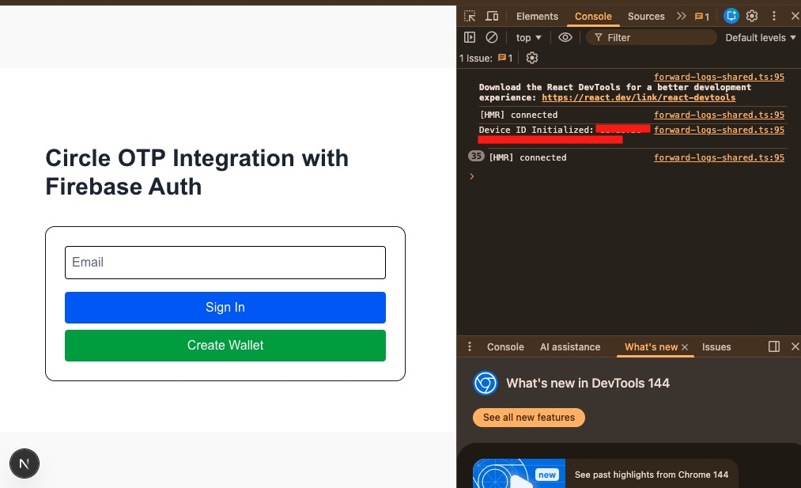
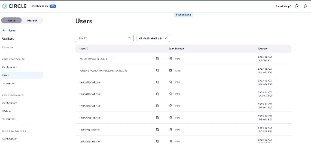
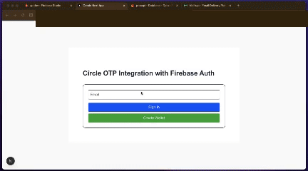

# Circle Wallet Onboarding (Demo)

A serverless Web3 wallet onboarding application built with **Next.js**, **Circle Programmable Wallets**, and **Firebase**.

This project demonstrates how to securely enroll users, initialize user-controlled wallets, and retrieve blockchain addresses using Circle’s embedded wallet infrastructure.

| User Authentication (OTP) | Wallet Management |
|  |  |

> A seamless onboarding experience bridging Firebase Auth and Circle Programmable Wallets.
---

## 🚀 Features

- Email-based wallet enrollment (OTP)
- User-controlled wallets (ETH Sepolia)
- Secure device initialization via Circle Web SDK
- Wallet address retrieval and display
- Firebase Firestore logging for auditability
- Single-page UX built with Next.js App Router
- Fully typed TypeScript codebase

---

## 🧱 Architecture

Browser (Web SDK)
↓
Next.js App Router
↓
API Routes (Serverless)
↓
Circle Programmable Wallets API
↓
Firebase Firestore (logging / persistence)

---

## 🛠 Tech Stack

- **Frontend:** Next.js (App Router), React, TypeScript
- **Wallets:** Circle Programmable Wallets (User-Controlled)
- **Backend:** Next.js API Routes
- **Database:** Firebase Firestore
- **Blockchain:** Ethereum Sepolia (testnet)

---

## 🔐 Authentication Model

This demo focuses on **wallet enrollment and initialization**, which is the primary integration point for Circle Programmable Wallets.

Returning user authentication flows are intentionally limited in this environment due to Circle’s device-trust and embedded security model, which is designed for production platforms with persistent trust signals.

---

## 📄 What This Project Demonstrates

- How to initialize wallets using Circle’s secure infrastructure
- How to safely manage device IDs and user tokens
- How to design serverless wallet onboarding flows
- How to log and audit wallet creation events
- How to integrate Web3 infrastructure into a modern frontend stack

---

## ⚠️ Limitations

- Returning login flows are not fully reproduced in a stateless demo environment
- Wallet actions are read-only (no signing or transactions)
- Testnet only (ETH Sepolia)

---

## 📌 Future Improvements

- Admin dashboard for wallet monitoring
- Wallet balance and transaction viewer
- Rate limiting and abuse protection
- ENS name resolution
- Multi-network support

---

## 🧠 Notes

This project is intended as a **technical demonstration** of wallet onboarding, not a production authentication system.

---
##Accomplishments

### **1. Identity & Database Foundation**

* **Firebase Integration:** Successfully linked a Next.js frontend to a Firestore backend to log authentication attempts and user activity.
* **User Mapping:** Established a logic where an email address is mapped to a unique `circleUserId` in your own database, creating a permanent link between your app and the blockchain.
* **Device Authorization:** Implemented the `getDeviceId` logic within the Circle SDK to ensure that every login attempt is tied to a secure, authorized browser session.

### **2. Backend "Smart" Logic**

* **Unified Authentication Flow:** Built a backend route (`/api/auth/otp`) that handles both new and returning users.
* **Conflict Resolution (409 Handling):** Successfully programmed the server to recognize the "User Already Exists" error from Circle and pivot automatically to a login flow instead of a creation flow.
* **Secure Token Acquisition:** Verified the successful retrieval of `userToken` and `encryptionKey` from the Circle API, which are the "golden keys" required to unlock a user's wallet.

### **3. Communication & Security**

* **Mailtrap Integration:** Configured a sandbox SMTP environment to safely test the delivery of 6-digit OTP codes.
* **Challenge Generation:** Successfully triggered the Circle "Challenge" system, which generates the secure environment needed for a user to input their code.
* **Email-to-Wallet Bridge:** Proved that entering a code from an email successfully authorizes the local SDK to access a specific blockchain account.

### **4. Blockchain & Wallet Connectivity**

* **Dynamic Wallet Retrieval:** Built the `wallet/route.ts` utility that uses a session token to pull live data from the Circle API.
* **Address Verification:** Successfully displayed the unique `0x...` Ethereum Sepolia address on the frontend UI after a successful login.
* **Multi-User Testing:** Confirmed that different test accounts (e.g., `test38`, `test43`) correctly generate or retrieve their own distinct wallet addresses.

### **5. UI/UX Architecture**

* **Conditional Step Logic:** Created a 3-step interface (Email -> OTP -> Wallet Active) that guides the user through the complex Web3 onboarding process.
* **Automated Listeners:** Implemented the `onLoginComplete` callback system, allowing the app to "react" the moment a user is verified without requiring manual page refreshes.
* **Visual Feedback:** Integrated real-time status updates in the terminal and UI to track the flow of tokens and session states.
”

## 📜 License

MIT
